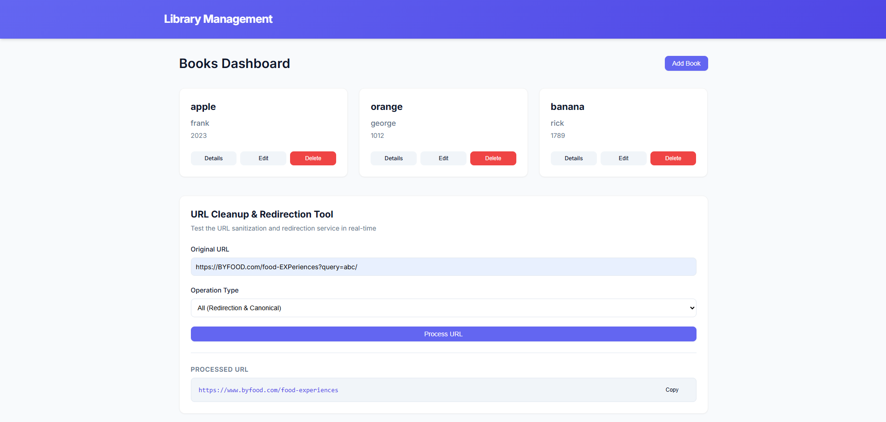
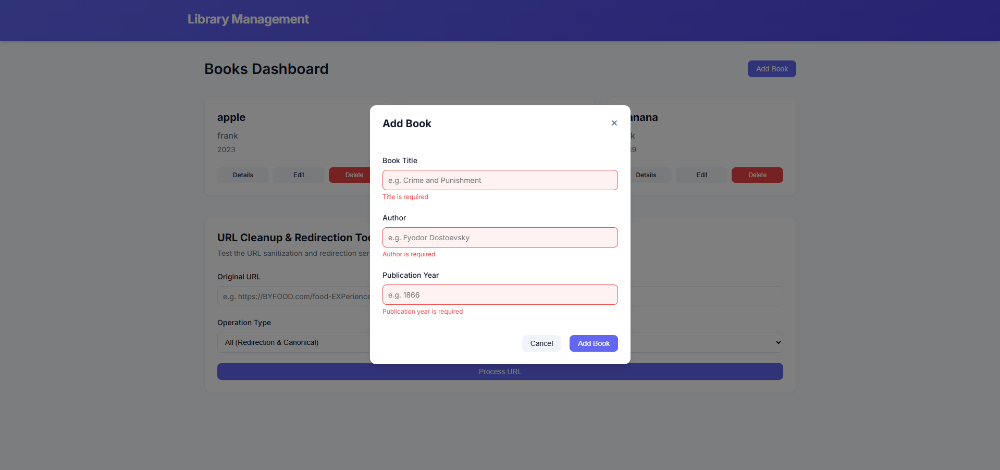
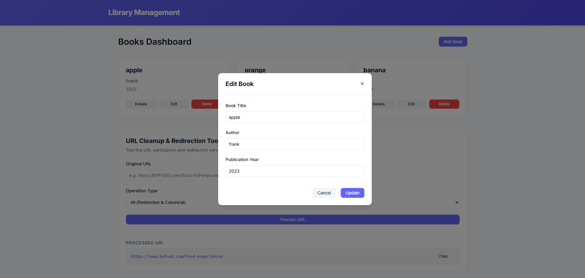
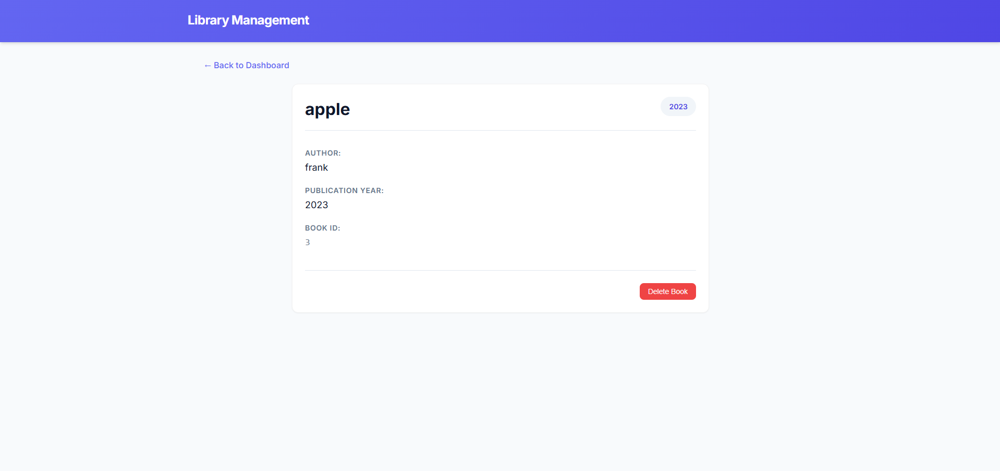
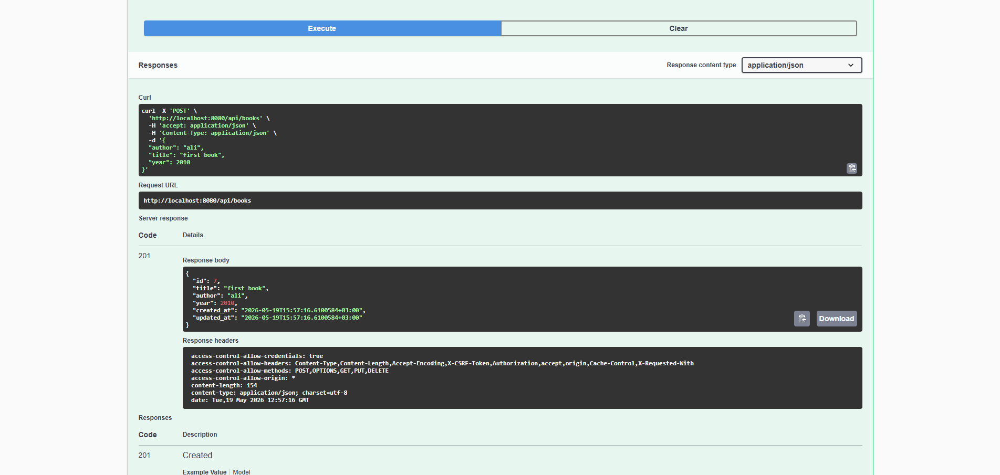
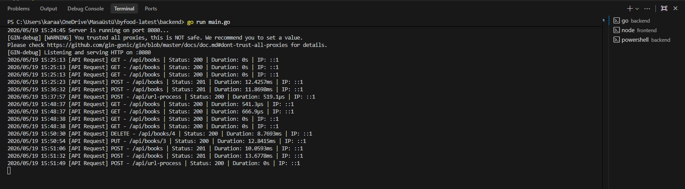
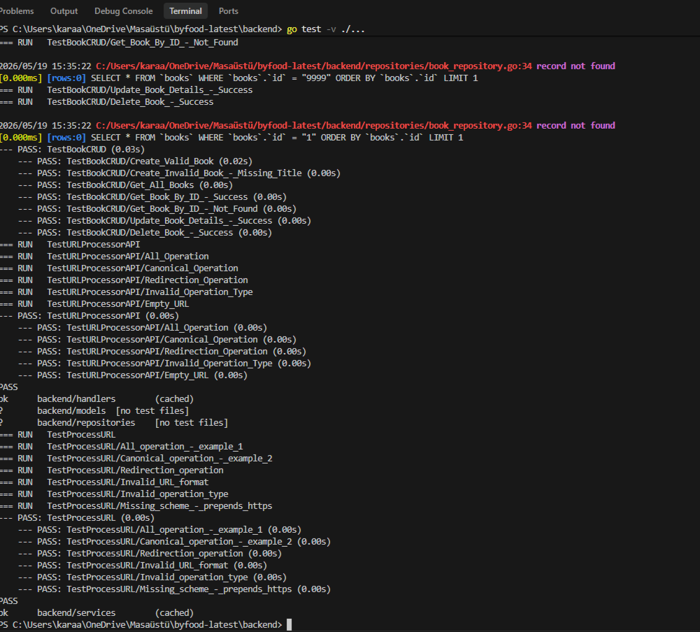

# 📚 byBooks - Full Stack Library & URL Processor

An elegant, full-stack application featuring a **Library Book CRUD** system and a high-performance **URL Cleanup & Redirection Tool**. The project is designed using the **Layered Architecture (Service-Repository Pattern)** on the backend and a component-driven React framework on the frontend.

---

## 🛠️ Tech Stack & Key Features

### Backend (`/backend`)
* **Language & Framework:** Go 1.20+ with [Gin Web Framework](https://gin-gonic.github.io/gin/)
* **ORM:** [GORM](https://gorm.io/)
* **Database:** SQLite (integrated via the Pure Go, CGO-free `github.com/glebarez/sqlite` driver for cross-platform zero-config runs)
* **API Documentation:** Interactive [Swagger UI](http://localhost:8080/swagger/index.html)
* **Architecture:** 3-Tier Layered Architecture (Handlers ➔ Services ➔ Repositories) with strict Dependency Injection
* **Security & Validation:** Gin Playground Validator rules & custom CORS + request logging middlewares

### Frontend (`/frontend`)
* **Framework:** React 19 with [Vite](https://vite.dev/)
* **Routing & State:** React Router v7 & Context API (global Book & URL states)
* **Icons:** [Lucide React](https://lucide.dev/)
* **Styling:** Modern, responsive Vanilla CSS with CSS custom properties (variables), clean micro-animations, and unified card components.

---

## 🏛️ System Architecture

The backend utilizes a decoupled, testable, three-tier architecture:
1. **Presentation Layer (Handlers):** Validates incoming requests and binds them to structural models.
2. **Business Logic Layer (Services):** Orchestrates domain logic and performs core algorithms (e.g. URL processing).
3. **Data Access Layer (Repositories):** Manages SQLite access through GORM interfaces.

```text
  [ Client UI (Vite) ]
          │
          ▼
  [ Client Request ]
          │
          ▼ (Port 8080)
  ┌───────────────┐
  │   Handlers    │ ◄─── (CORS & Logger Middlewares)
  └───────┬───────┘
          │
          ▼
  ┌───────────────┐
  │   Services    │
  └───────┬───────┘
          │
          ▼
  ┌───────────────┐
  │ Repositories  │
  └───────┬───────┘
          │
          ▼
  ┌───────────────┐
  │  SQLite DB    │ ◄─── (Auto-migrated library.db file)
  └───────────────┘
```

---

## 📁 Project Structure

```text
byfood-latest/
├── backend/
│   ├── config/             # DB connection, SQLite (pure Go) setup
│   │   └── database.go
│   ├── docs/               # Auto-generated Swagger specifications
│   ├── handlers/           # HTTP controllers & request parsing
│   │   ├── book_handler.go
│   │   └── url_handler.go
│   ├── models/             # GORM models & Playground Validation schemas
│   │   ├── book.go
│   │   └── url.go
│   ├── repositories/       # GORM SQLite abstractions
│   │   └── book_repository.go
│   ├── services/           # Business domain logic and unit tests
│   │   ├── book_service.go
│   │   ├── url_service.go
│   │   └── url_service_test.go
│   ├── BACKEND_GUIDE.md    # Detailed internal technical architecture manual
│   ├── main.go             # Application entrypoint & middleware mounting
│   ├── go.mod
│   └── go.sum
└── frontend/
    ├── src/
    │   ├── assets/         # App assets & media
    │   ├── components/     # Reusable components (BookForm, UrlProcessor, etc.)
    │   ├── context/        # BookContext for global actions & API states
    │   ├── pages/          # Layout views (Dashboard, BookDetail)
    │   ├── App.css         # UI structural layout and animations
    │   ├── App.jsx         # App router setup
    │   ├── index.css       # CSS Variables (Color system, fonts, transitions)
    │   └── main.jsx        # React DOM render mount
    ├── package.json
    └── vite.config.js
```

---

## 🚀 Setup & Execution

Ensure you have [Go (1.20+)](https://go.dev/dl/) and [Node.js (v18+)](https://nodejs.org/) installed.

### Option A: Automated Startup (Recommended)

You can run automated scripts at the project root to automatically fetch dependencies and start both servers concurrently in separate console windows.

* **On Windows:**
  Double-click the `run.bat` file in the project root, or execute:
  ```bash
  ./run.bat
  ```

* **On macOS / Linux:**
  Grant execution permissions and execute the `start.sh` script:
  ```bash
  chmod +x start.sh
  ./start.sh
  ```

---

### Option B: Manual Step-by-Step Setup

#### 1. Launch Backend Server
1. Navigate to the `backend` directory:
   ```bash
   cd backend
   ```
2. Download dependencies:
   ```bash
   go mod download
   ```
3. Run the Go server:
   ```bash
   go run main.go
   ```
4. The backend will initialize `library.db` automatically and run on **`http://localhost:8080`**.

#### 2. Launch Frontend Application
1. Open a new terminal window and navigate to the `frontend` directory:
   ```bash
   cd frontend
   ```
2. Install npm packages:
   ```bash
   npm install
   ```
3. Start the Vite development server:
   ```bash
   npm run dev
   ```
4. The client application will launch and be accessible at **`http://localhost:5173`**.

---

## 🧪 Running Unit Tests

Backend logic is covered by table-driven unit tests. To execute them:

1. Navigate to the `backend` folder:
   ```bash
   cd backend
   ```
2. Run test execution with verbose output:
   ```bash
   go test -v ./services/...
   ```

*These tests cover URL cleaning cases (all, canonical-only, redirection-only, missing schemes, invalid operation schemas, and edge case parameters).*

---

## 📝 API Endpoints & Usage

### 📖 Book CRUD
*All paths are prefixed with `/api`.*

| Method | Endpoint | Description |
| :--- | :--- | :--- |
| **GET** | `/api/books` | Fetch all books in the library |
| **POST** | `/api/books` | Add a new book (validates fields) |
| **GET** | `/api/books/:id` | Fetch detail of a single book by ID |
| **PUT** | `/api/books/:id` | Update title, author, or year of a book |
| **DELETE** | `/api/books/:id` | Delete a book entry |

#### **Example Payload (POST `/api/books`):**
```json
{
  "title": "Clean Architecture",
  "author": "Robert C. Martin",
  "year": 2017
}
```

---

### 🔗 URL Processor Service

Processes and cleanses target URLs depending on the selected execution context.

| Method | Endpoint | Description |
| :--- | :--- | :--- |
| **POST** | `/api/url-process` | Cleanse, standardize, or redirect an arbitrary URL |

#### **Operations:**
* **`canonical`**: Removes all query parameters and fragments, and strips trailing slashes.
* **`redirection`**: Replaces the source domain with `www.byfood.com` and standardizes scheme & case formatting.
* **`all`**: Runs both processes consecutively.

#### **Example Request Payload:**
```json
{
  "url": "https://BYFOOD.com/food-EXPeriences?query=abc/",
  "operation": "all"
}
```

#### **Example Success Response:**
```json
{
  "processed_url": "https://www.byfood.com/food-experiences"
}
```

---

## 🌐 Interactive Swagger API Console

When the backend server is running locally, you can view the fully documented interactive console to execute requests:

👉 **[http://localhost:8080/swagger/index.html](http://localhost:8080/swagger/index.html)**

---

## 📸 Working Application Screenshots

Below are screenshots demonstrating the various features, modals, and execution logs of the application.

### 💻 Frontend Dashboard & Modals
* **Dashboard Overview:** Displaying the responsive library list and the integrated URL processor utility.
  

* **Add Book Modal:** Overlay modal containing the controlled form inputs and validation feedback.
  

* **Edit Book Modal:** Pre-filled overlay modal for updating existing library entries.
  

* **Book Detail Page:** Route showing details for a selected book and delete execution.
  

### ⚙️ Backend Logs & API Reference
* **Interactive Swagger Interface:** Interactive endpoint reference at `/swagger/index.html`.
  

* **API HTTP Request Logs:** Terminal logging of HTTP methods, response codes, latencies, and client IPs.
  

* **Automated Unit & Integration Tests:** Clean, passing executions of all backend test suites.
  

